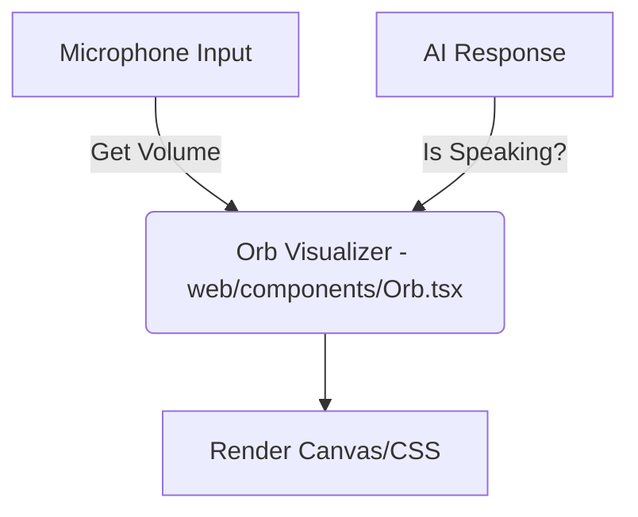

# Gemini Live API Demo: Next.js & React Native Expo

This repository demonstrates how to build a real-time, multimodal voice AI application using Google's **Gemini Live API** with **Proactive Audio**. It includes implementations for:

*   **Backend**: A Python WebSocket proxy to handle API authentication and connection.
*   **Web**: A Next.js application using the Web Audio API and a custom visualizer.
*   **Mobile**: A React Native Expo app using `react-native-audio-api` for high-performance audio streaming.

## 🚀 Getting Started

### Prerequisites

*   **Google Cloud Project**: Enabled with the Gemini API.
*   **API Key**: A valid Gemini API key.
*   **Node.js & Python**: Installed on your machine.
*   **Development Build**: For the mobile app, you must create a development build as it uses native code.

### Installation

1.  **Backend**:
    ```bash
    cd cookbook/quickstarts/websockets
    pip install -r requirements.txt
    ```

2.  **Web**:
    ```bash
    cd web
    npm install
    ```

3.  **Mobile**:
    ```bash
    cd frontend
    npm install
    npx expo prebuild
    ```

### Running the App

1.  **Start the Backend**:
    ```bash
    # In cookbook/quickstarts/websockets
    export GOOGLE_API_KEY="your_api_key"
    python Get_started_LiveAPI.py
    ```

2.  **Start the Web App**:
    ```bash
    # In web
    npm run dev
    ```
    Open [http://localhost:3000](http://localhost:3000).

3.  **Start the Mobile App**:
    ```bash
    # In frontend
    npm run android # or npm run ios
    ```

---

## 📖 Full Article: Building Real-Time Voice AI

[Read on Medium](https://medium.com/@yourusername/building-real-time-voice-ai-integrating-gemini-live-api-with-next-js-and-react-native-expo-mock-link)

*(Full article content below)*

# Building Real-Time Voice AI: My Journey Integrating Gemini Live API with Next.js and React Native Expo

The era of real-time, multimodal AI is here, and I've been diving deep into it. Google's Gemini Live API allows developers to build seamless, low-latency voice interfaces that feel like natural conversation. In this article, I want to share my experience implementing the Gemini Live API with **Proactive Audio**, integrating it into both a **Next.js web application** and a **React Native Expo mobile app**.

I'll walk you through the critical parts of the API integration, the nuances of audio encoding in the browser, and the specific challenges I faced—and solved—when handling real-time audio streams on mobile devices.

## Prerequisites

Before diving in, make sure you have:

- **Google Cloud Project**: Enabled with the Gemini API.
- **API Key**: A valid Gemini API key.
- **Node.js & Python**: Installed on your machine.
- **Development Build**: Since we're using native code (`react-native-audio-api`), Expo Go won't work. You'll need to create a development build.

---

## 1. The Core: Gemini Live API & Proactive Audio

The foundation of my application is the Gemini Live API, accessed via WebSockets. This isn't just a simple request-response model; it's a bidirectional stream where audio and text flow freely in both directions. This is what enables the "interruptibility"—if I start talking while the AI is speaking, it stops and listens, just like a human would.

### Why Proactive Audio?

One of the features I was most excited to implement is **Proactive Audio**. Traditionally, voice assistants wait for a wake word or a button press. Proactive Audio allows the model to initiate conversation or respond without a direct user prompt when configured. It makes the interaction feel less like a command line and more like a chat with a friend.

### The Connection Handshake

Based on the Google Cloud documentation and the [Google Cloud Generative AI Cookbook](https://github.com/google-gemini/cookbook) examples I followed, setting up the connection involves a specific handshake:

1.  **WebSocket Connection**: I connect to `wss://generativelanguage.googleapis.com/ws/google.ai.generativelanguage.v1beta.GenerativeService.BidiGenerateContent`.
2.  **Setup Message**: Immediately after connecting, I send a JSON payload to configure the session. This is where I define the model, the response modalities (I want AUDIO), and the voice configuration.

```python
# Python Backend Example (cookbook/quickstarts/websockets/Get_started_LiveAPI.py)
setup_msg = {
    "setup": {
        "model": "models/gemini-2.5-flash-native-audio-latest",
        "generation_config": {
            "response_modalities": ["AUDIO"],
            "speech_config": {
                "voice_config": {"prebuilt_voice_config": {"voice_name": "Puck"}}
            }
        }
    }
}
await ws.send(json.dumps(setup_msg))
```

### The Protocol Details

The communication protocol is straightforward but strict:

- **Client -> Server**: I send `realtime_input` messages. These contain `media_chunks` (raw PCM audio data) or `client_content` (text).
- **Server -> Client**: I receive `serverContent` messages. These contain `modelTurn` (the audio/text response) and, crucially, `turnComplete` signals.
- **Turn Complete**: This signal is vital. It tells my frontend that the AI has finished its thought. I use this to trigger UI updates (like stopping the "listening" animation) or to flush any remaining audio buffers to ensure the user hears the very end of the sentence.

---

## 2. Next.js Web Integration

For the web frontend, I chose **Next.js** because of its robust ecosystem. However, the real heavy lifting happens with the native **Web Audio API**. My architecture relies on a WebSocket connection to a backend proxy (which handles the API key and the actual connection to Google to keep my secrets safe).

### The Audio Encoding Challenge

The Gemini API is very specific about audio formats:

- **Input (Microphone)**: It expects PCM 16-bit, 16kHz, Mono.
- **Output (Playback)**: It sends back PCM 16-bit, 24kHz, Mono.

The problem? `getUserMedia` in the browser usually captures audio at the system default, often 44.1kHz or 48kHz. If I sent that directly, Gemini would reject it or sound like a chipmunk. I had to implement a downsampling processor.

I used a `ScriptProcessorNode` (though `AudioWorklet` is the modern standard, `ScriptProcessorNode` was quicker for prototyping) to capture the raw audio buffer, downsample it to 16kHz, and convert the Float32 data (which browsers use) into Int16 PCM data.

```typescript
// Web Audio API: Downsampling and Conversion (web/app/page.tsx)
const processor = recordingContext.createScriptProcessor(4096, 1, 1);

processor.onaudioprocess = (e) => {
  const inputData = e.inputBuffer.getChannelData(0);

  // Convert Float32 (-1.0 to 1.0) to Int16 PCM
  const pcmData = new Int16Array(inputData.length);
  for (let i = 0; i < inputData.length; i++) {
    // Clamp the value and scale it to 16-bit integer range
    const s = Math.max(-1, Math.min(1, inputData[i]));
    pcmData[i] = s < 0 ? s * 0x8000 : s * 0x7fff;
  }

  // Send base64 encoded PCM to server
  ws.send(JSON.stringify({ audio: base64Data }));
};
```

### Orb Visualizer: The most original animation for AI voice interfaces.

To make the AI feel "alive," I didn't want just a text box. I wanted a visual representation of the voice. I implemented an "Orb" component.

I used a simple volume analysis node in the Web Audio graph to get the real-time volume level of the user's speech (or the AI's playback). I mapped this volume level to the CSS `transform: scale()` and `opacity` properties of a glowing sphere.



This creates a responsive UI that pulses when you talk and glows when the AI thinks, providing that immediate, visceral feedback that makes voice interfaces feel ominous.

---

## 3. React Native Expo Integration

Bringing this experience to mobile with **Expo** was where I hit the biggest hurdles. The web is forgiving; mobile is not.

### The Challenge: In-Memory Transcoding & Streaming

React Native doesn't have a full Web Audio API by default. I used `react-native-audio-api` to polyfill this functionality, but I quickly ran into a major stability issue (on android at least). I found a great article by [Callstack](https://www.callstack.com/blog/from-files-to-buffers-building-real-time-audio-pipelines-in-react-native) that helped me understand the in-memory transcoding challenges.

Streaming raw PCM data means I'm receiving dozens of small audio chunks every second. Initially, I tried creating a new `AudioBufferSourceNode` for every single chunk (e.g., 40ms of audio).

- **The Crash**: This overwhelmed the React Native bridge. The garbage collector couldn't keep up with creating and destroying hundreds of audio nodes. The audio would start glitching (the dreaded "chipmunk effect" due to sample rate mismatches) and then, after about 30 seconds, the app would just crash.
- **The Leak**: Native resources weren't being released fast enough, leading to a memory leak that inevitably killed the app.

### The Solution: AudioBufferQueueSourceNode & Buffering

I solved this by digging deeper into `react-native-audio-api` and finding the `AudioBufferQueueSourceNode`. This is a mobile-specific node designed exactly for this use case—queuing up multiple buffers to play in sequence.

But simply switching nodes wasn't enough. I also had to implement a custom buffering strategy:

1.  **Buffering**: Instead of sending every tiny chunk to the native layer, I accumulate them in JavaScript into a larger buffer (about 0.5s to 1s of audio).
2.  **Queueing**: Once my buffer is full, I create a single `AudioBuffer` and enqueue it. This reduces the bridge traffic by a factor of 20x.
3.  **Safety Valve**: I added a "safety valve" to monitor the queue size. If the queue grows too large (say, >50 buffers), it means the network is sending audio faster than the device can play it (or something is stuck). In this case, I proactively clear the buffer and recreate the source node. This prevents the hard crash and keeps the app running, even if it means skipping a split second of audio.

```typescript
// React Native: Handling Audio Stream (frontend/hooks/useAudioConnection.ts)
const playAudioChunk = async (base64Data: string) => {
  // 1. Decode Base64 to Byte Array
  const byteArray = base64js.toByteArray(base64Data);

  // 2. Buffer Accumulation
  pendingChunksRef.current.push(byteArray);
  pendingSizeRef.current += byteArray.length;

  // 3. Flush when threshold reached (~1s)
  if (pendingSizeRef.current >= BUFFER_THRESHOLD) {
    flushAudioBuffer();
  }
};

const flushAudioBuffer = () => {
  // ... Convert to Float32 ...
  // ... Create AudioBuffer ...

  // 4. Enqueue to Native Node
  source.enqueueBuffer(audioBuffer);

  // 5. Monitor Queue Size
  if (queueSize > 50) {
    // Emergency cleanup to prevent crash
    console.warn("Queue too large, recreating source");
    recreateAudioSource();
  }
};
```

### Conclusion

Integrating Gemini Live API required me to pay careful attention to audio fundamentals. On the web, it was about matching sample rates and encoding. On mobile, it was a battle with native resource management and memory. But by solving these low-level challenges, I was able to unlock a magical, real-time conversational experience that works smoothly across both platforms.
